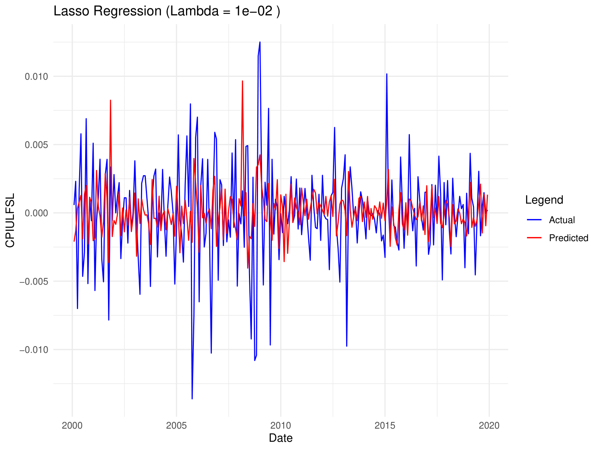

# Inflation Forecasting with ML

This updated university group project focuses on forecasting inflation using various time series techniques. The dataset FRED-MD is provided by the Federal Reserve Bank of St. Louis, a trusted authority in macroeconomic data.

## Methodology

I used a mix of traditional econometric models and modern machine learning techniques to forecast inflation. These include:

- **AR(1) Model**: A baseline autoregressive model for inflation trends.
- **Lasso and Ridge Regression**: Regularization techniques to select predictors and handle multicollinearity.
- **Principal Component Regression (PCR)**: Dimensionality reduction for large datasets.
- **Vector Autoregression (VAR)**: Captures relationships between inflation and other macroeconomic indicators.
- **Random Forest (RF)**: Models non-linear patterns in the data.

## Files

**`PreProcessing.R`** Prepares the dataset, handles missing values, checks stationarity, and visualizes time series.

**`AR1.R`** Implements the AR(1) model as a benchmark.

**`Lasso.R`** Fits a Lasso regression model with tuned regularization parameters.

**`Ridge.R`** Applies Ridge regression following the same logic.

**`PCR.R`** Performs Principal Component Regression, optimizing the number of principal components.

**`VAR.R`** Fits VAR models, optionally using PCA preprocessing.

**`RF.R`** Uses Random Forest to experiment with a non linear method.

**`Presentation.pdf`** Set of slides explaining the methodology, results, and model comparisons.

**`current.csv`** Contains US monthly macroeconomic indicators from the Federal Reserve.

## Results Example

Below is a visualization of the Lasso Regression results from the analysis. For further details and insights, please refer to the presentation slides.

## User Guide

1. **Setup**:
   - Place `current.csv` in the same directory as the scripts (a relative path is used).
   - If you prefer, download the monthly dataset `current.csv` from the [FRED-MD website](https://www.stlouisfed.org/research/economists/mccracken/fred-databases).

2. **Execution**:
   - Start by running `PreProcessing.R`, as all other scripts depend on the preprocessed data.
   - Metrics are printed in the console, and plots are saved as PDF files in the same directory.

3. **Packages**:
   - Uncomment the `install.packages()` lines in the scripts to install any missing R packages. The full list of required packages is provided in the `PreProcessing.R` script.

## Contacts
For any clarifications, questions, or to report issues with the code, feel free to reach out via email at alessandro.dodon@usi.ch. You can also find my LinkedIn link in my GitHub bio.

